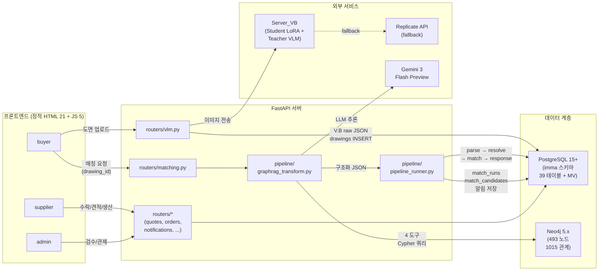
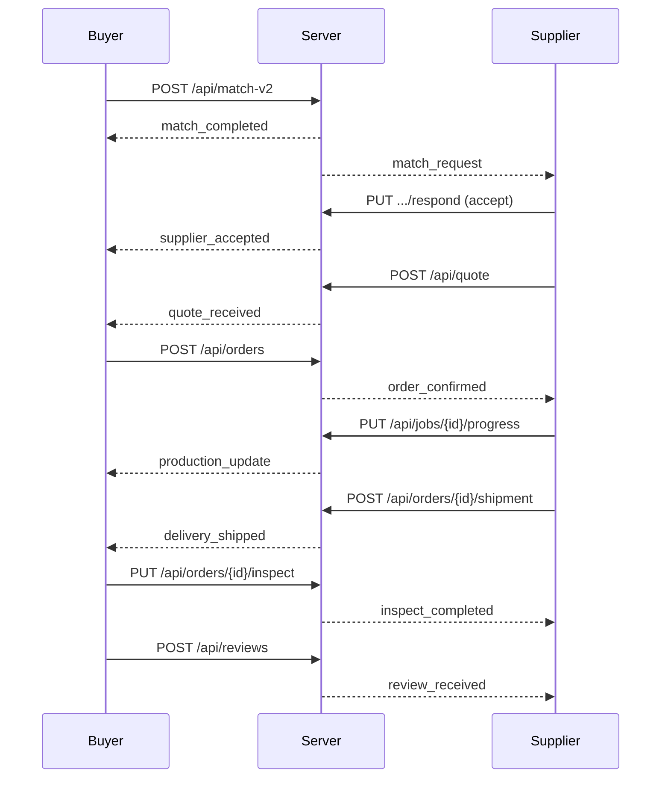

# IMMA Architecture

IMMA(Intelligent Manufacturing Matching Agent)는 제조업 발주자가 도면을 업로드하면, VLM이 도면에서 재질/공정/치수/공차를 추출하고, Neo4j 제조 지식 그래프와 PostgreSQL 업체 DB에 대조하여 최적의 가공 업체를 자동 매칭하는 플랫폼이다. 매칭 후 견적-발주-생산 관리-납품-리뷰까지 전체 제조 발주 라이프사이클을 관리한다.

---

## 1. 시스템 아키텍처 다이어그램

### 전체 데이터 흐름



### 매칭 파이프라인 상세 흐름

```
도면 이미지 (multipart)
  │
  ├─ POST /vlm/analyze-upload ─── Server_VB (또는 Replicate fallback)
  │     └─ V.B raw JSON → drawings.vlm_result_jsonb INSERT
  │
  └─ POST /api/match-v2 (drawing_id + buyer 입력)
        │
        ├─ drawings 조회 + 소유권 검증
        ├─ graphrag_transform.py ─── LangGraph ReAct + Gemini + Neo4j 4 도구
        │     └─ 구조화 JSON (parts[])
        │
        ├─ parse.py ──── JSON → VlmPart 변환
        ├─ resolve.py ── 재질 7단계 해소 + 온톨로지 검증
        ├─ match.py ──── SQL 하드필터 + 장비 검증 + 순서 검증
        ├─ response.py ─ 응답 조립 (사내/외주 공정 분리)
        │
        └─ _save_match_history()
              ├─ match_runs 1행 + match_candidates N행 저장
              ├─ supplier에게 match_request 알림
              └─ buyer에게 match_completed 알림
```

---

## 2. 기술 스택

| 구성요소 | 기술 |
|---|---|
| 관계형 DB | PostgreSQL 15+ (imma 스키마, pgcrypto/citext/pg_trgm/btree_gin 확장) |
| 그래프 DB | Neo4j 5.x (493 노드 / 1015 관계, 로컬 + ngrok TCP 터널) |
| 백엔드 서버 | FastAPI (66개 API 엔드포인트 + 21개 UI 서빙 라우트) |
| 매칭 파이프라인 | Python (parse → resolve → match → response 4단계 체이닝) |
| GraphRAG 변환 | LangGraph ReAct Agent + Gemini 3 Flash Preview (thinking_level=low, temperature=1.0) |
| VLM 도면 분석 | Server_VB (Student LoRA Qwen2.5-VL 7B + Teacher Qwen3-VL-30B-A3B-Instruct-FP8) + Replicate API fallback |
| 프론트엔드 | 정적 HTML 21개 + 공용 JS 5종 + CSS 2종 (동일 origin에서 FastAPI가 서빙) |
| 배포 | Railway + PostgreSQL Plugin + ngrok TCP(Neo4j 터널) |

---

## 3. 매칭 파이프라인

매칭 파이프라인은 `pipeline/` 디렉토리에 위치하며, VLM이 추출한 도면 정보를 해석하여 최적 가공 업체를 선정한다.

### 모듈별 역할

| 모듈 | 파일 | 역할 |
|---|---|---|
| **진입점** | `pipeline_runner.py` | DB 저장 → parse → resolve → match → response 체이닝. 단부품 RFQ에서 VLM quantity가 1(기본값)인 경우 buyer 입력 `order_quantity`로 대체. 다부품 RFQ는 VLM 추출 수량 보존 |
| **파싱** | `parse.py` | VLM JSON → `VlmPart` 변환. null/타입 방어, +/- IT 환산, 표면거칠기(삼각기호) → Ra 변환, 나사 오탐 방지 |
| **해소** | `resolve.py` | 재질 7단계 해소(코드 → alias → 규격접미사 → 템퍼접미사 → 카테고리텍스트 → LIKE → regex), 일반공차 fallback(KS B ISO 2768-1), 형상 분류(축물/각형물), 호환성 검증, 도면 피드백 |
| **매칭** | `match.py` | MV 기반 SQL 하드필터, 장비별 공정 달성 IT/Ra 교차 검증, 공정 순서 검증. 카테고리 확장, parent fallback(화이트리스트 한정). `_populate_equipment_summary`가 후보별 장비 카테고리 보유 수 + 대표 모델을 산출 |
| **응답** | `response.py` | 매칭 결과 JSON 조립. ontology_warnings 합류. 사내 공정과 외주 공정을 분리 표시. 후보 객체에 `equipment_summary` 필드 전달 |
| **정적 지식** | `lookup.py` | 단일 원천. STAGE_TO_CODES 54항목, PRECISION/INTERMEDIATE/NON_MACHINING/FAIL_OPEN_PROCESSES 공정 집합, CATEGORY_TEXT_TO_CODE 51항목, PROC_NORMALIZE 5항목, `SAFE_PARENT_FALLBACK` 화이트리스트 |
| **GraphRAG** | `graphrag_transform.py` | VLM raw JSON → 구조화 JSON 변환. Gemini 3 Flash Preview + Neo4j 4 도구 + SYSTEM_PROMPT 제약 (상세: 14절) |
| **데이터** | `models.py` | `VlmPart`(unsupported 포함), `ResolvedPart`(ontology_warnings 포함), `MatchCandidate`, `MatchResponse` 데이터 클래스 |
| **DB** | `db.py` | psycopg2 단건 연결, 트랜잭션 컨텍스트매니저, 쿼리 헬퍼 |
| **설정** | `config.py` | DB 접속 정보, 룩업 JSON 경로, 환경변수 (DATABASE_URL 우선 + 개별 변수 fallback) |
| **초기화** | `setup_db.py` | DDL 실행, seed 데이터(재질 68개 + alias + mock 업체 19개 + seed 계정). `--reset` 옵션으로 스키마 전체 재생성 가능 |
| **Neo4j 시드** | `seed_neo4j.py` | Neo4j 그래프 시드. 환경변수 `NEO4J_URI` 대응, 기본값 localhost:7687 |

### 하드필터 → 장비검증 → 스코어링 흐름

```
ResolvedPart(들)
  │
  ├─ build_hard_filter_sql()
  │     MV(company_capability_summary) 기반
  │     ├─ 재질 코드/카테고리 매칭 (카테고리 확장 포함)
  │     ├─ 공정 코드 매칭 (MV 자식→부모 확장, FAIL_OPEN 제외)
  │     ├─ 크기 envelope (선삭 직경/길이 또는 XYZ 이동량)
  │     ├─ IT 등급, Ra 조도 필터
  │     └─ onboarding_status='verified' + accepting_orders=true
  │
  ├─ _populate_equipment_summary()
  │     후보별 카테고리별 보유 장비 수 + 대표 모델 산출
  │
  ├─ run_equipment_verification()
  │     공정별 장비 IT/Ra 교차 검증
  │     ├─ 정밀 공정 (PRECISION_PROCESSES): 전용 장비 필수
  │     ├─ 중간 공정 (INTERMEDIATE_PROCESSES): 장비 확인
  │     ├─ 비가공 공정 (NON_MACHINING): fail-open
  │     ├─ parent fallback: SAFE_PARENT_FALLBACK 화이트리스트만 허용
  │     └─ 플라스틱/복합재 IT/Ra override 18행 적용
  │
  ├─ check_process_sequence()
  │     공정 순서 규칙 22개 대조
  │
  └─ _compute_availability_score()
        사내/외주 공정 분리 후 사내 가능 장비 시간합 기반
        ├─ equipment_daily_schedule 기반 실 가용 캐파 계산
        ├─ 시드 범위 초과 납기: 0.7 폴백
        ├─ 전외주 RFQ: 0.9
        └─ 장비 0대 신규 업체: 0.3
```

### 재질 해소 7단계 (resolve.py)

`resolve_part()`가 VlmPart의 raw material 텍스트를 표준 material_code + category_code로 변환한다:

```
1. 직접 코드 매칭    ── materials.material_code 직접 일치
2. alias 매칭        ── material_aliases.alias_text 일치
3. 규격 접미사 제거   ── "SUS304-H" → "SUS304" 등 접미사 strip 후 재시도
4. 템퍼 접미사 제거   ── "A5052-T6" → "A5052" 등 열처리 기호 strip
5. 카테고리 텍스트 매칭 ── CATEGORY_TEXT_TO_CODE 51항목 ("스테인리스" → stainless_steel 등)
6. LIKE 매칭         ── DB LIKE '%keyword%' 패턴
7. regex 매칭        ── 마지막 수단 정규식 패턴
```

해소 실패 시 `unsupported=true`가 설정되고 `[unsupported]` 경고가 ontology_warnings에 추가된다.

### 스코어 산출

| 구분 | 산출식 | 가중치 |
|---|---|---|
| technical_score | `(18 - best_it_grade) / 18` | 0.4 |
| availability_score | 장비 스케줄 기반 가용 캐파 계산 | 0.3 |
| quality_score | `avg_rating / 5.0` | 0.3 |
| **total_score** | 가중합 | 1.0 |

---

## 4. 온톨로지 검증 3종

파이프라인의 `resolve.py`에서 수행하는 3종 검증은 `ontology_warnings` 리스트에 경고를 누적하며, 최종 응답의 warnings에 합류한다. 매칭 유효성 판정(`is_valid`)에는 영향을 주지 않는 정보성 경고이다.

### 4.1 재질-공정 호환성 검증

`_check_material_process_compatibility()` -- 재질 카테고리 코드와 required_processes를 `MATERIAL_PROCESS_COMPATIBILITY` 224행(14 카테고리) 호환성 매트릭스에 대조한다. `limited` 판정 시 경고를 부착한다. 비전도성 재질(플라스틱, 복합재)에 EDM을 배정하는 조합은 GraphRAG 프롬프트 단계에서 차단한다.

### 4.2 공정 순서 검증

`check_process_sequence()` -- required_processes와 post_treatment를 `PROCESS_SEQUENCE_CONSTRAINTS` 22개 규칙에 대조한다.
- absolute_rule 9행: 위반 시 `[공정순서 위반]` 신호
- recommended 11행: 위반 시 `[공정순서 권장위반]` 신호
- cannot_run_concurrently 2행 (비활성화 상태)
- stock_preparation은 스킵하며, applies_to 조건 필터링과 빈 set 규칙 스킵이 적용된다

### 4.3 도면 피드백

`_check_drawing_feedback()` -- 도면 추출 데이터의 품질을 점검하는 7개 규칙:

| 규칙 | 조건 |
|---|---|
| 정밀 공차 + 정밀 공정 부재 | IT <= 6 이면서 정밀 가공 공정이 required_processes에 없을 때 |
| 극미세 조도 + 호닝/래핑 부재 | Ra <= 0.4 이면서 호닝 또는 래핑이 없을 때 |
| 외형 치수 전부 미추출 | envelope 치수가 모두 null일 때 |
| 선삭 + 외경 미추출 | turning 공정 존재하나 outer_diameter가 null일 때 |
| 열처리 + 경도 미기재 | heat_treatment가 있으나 경도 값이 없을 때 |
| GDT + IT/Ra 미추출 | GDT가 존재하나 IT 등급과 Ra가 모두 null일 때 |
| 공정별 달성 공차 사전경고 | 정밀 공정 존재 시 억제 |

프론트엔드에서는 `imma-phase1-pages.js`의 `classifyReason`/`cleanReason`/`renderReason`이 `[INFO_*]`, `[WARN_*]`, `[공정순서 위반]`, `[unsupported]` 등의 신호를 positive/info/warn/danger/neutral 5단계 색상 칩으로 시각화한다.

---

## 5. Neo4j 지식 그래프

Neo4j는 매칭 파이프라인에서 **선택적으로** 사용된다. GraphRAG 변환 레이어가 LLM의 도구 호출을 통해 Cypher 쿼리를 실행하며, Neo4j 연결이 실패하면 LLM만으로 변환을 시도한다. 매칭 파이프라인 본체(`resolve.py`, `match.py`)는 인메모리 룩업 테이블(`lookup.py`)을 사용하므로 Neo4j 의존성이 없다.

### 노드

| 노드 라벨 | 수 | 주요 속성 |
|---|---|---|
| MaterialCategory | 15 | code, name_ko |
| Material | 68 | code, name_ko, jis_code, 물성(tensile/yield/hardness/corrosion 등) |
| MaterialAlias | 270 | text |
| Process | 81 | code, name_ko, IT/Ra 범위 |
| EquipmentModel | 59 | model_id, manufacturer, category_code |

### 관계

| 관계 타입 | 수 | 방향 |
|---|---|---|
| ALIAS_OF | 276 | MaterialAlias -> Material |
| COMPATIBLE_WITH | 224 | MaterialCategory -> Process |
| ALTERNATIVE_TO | 181 | Material -> Material |
| CAPABLE_OF | 108 | EquipmentModel -> Process |
| INCLUDES | 101 | Process(추상) -> Process(구체) |
| BELONGS_TO | 68 | Material -> MaterialCategory |
| RECOMMENDED_BEFORE | 32 | Process -> Process |
| CHILD_OF | 14 | Process -> Process |
| MUST_PRECEDE | 9 | Process -> Process |
| CANNOT_RUN_CONCURRENTLY | 2 | Process -> Process |

**전체: 493 노드, 1015 관계**

시드 스크립트: `pipeline/seed_neo4j.py` (환경변수 `NEO4J_URI` 대응, 기본값 `neo4j://localhost:7687`)

---

## 6. 서버 (FastAPI) 표면

### 디렉토리 구조

```
fas_analysis/
├── main.py                  # FastAPI app + UI 라우트 21개 + CORS 화이트리스트
├── machhub_ui/              # 프론트엔드 정적 파일
│   ├── *.html (21)          # buyer/supplier/admin/public 페이지
│   ├── auth.js              # 세션, JWT decode, verifySession, requireRole
│   ├── imma-api.js          # Authorization 자동 주입 fetch, 401 single-flight
│   ├── imma-ui-utils.js     # toast, escapeHtml, formatCurrency/Date/DateTime
│   ├── imma-phase1-pages.js # 21 페이지 route별 init (실 API 연결 본체)
│   ├── admin-menu.js        # admin 3페이지 사이드바 + Demo UI 배지
│   ├── imma-common.css      # 공용 스타일
│   └── role-workflows.css   # role별 워크플로 시각화
├── pipeline/                # 매칭 파이프라인 모듈 (3절 참조)
├── routers/                 # API 라우터 16개 .py
│   ├── deps.py              # 공통 DB engine, JWT, 인증 의존성, 온보딩 자동 전환
│   ├── matching.py          # 매칭 v1/v2, 수락/거절
│   ├── vlm.py               # VLM 도면 분석
│   ├── quotes.py            # 견적 제출
│   ├── orders.py            # 발주, 생산, 검수, 배송
│   ├── companies.py         # 업체 관리, 장비/재질/공정 역량, 스케줄
│   ├── admin.py             # 관리자 로그인, 업체 검수
│   └── ... (auth, signup, rfqs, drawings, reviews, notifications, catalog, config)
├── lookup_tables/           # schema.sql + lookup_data.json + equipment_catalog.json
└── requirements.txt
```

### 엔드포인트 카테고리 (66개)

| 카테고리 | 수 | 핵심 엔드포인트 |
|---|---|---|
| 인증/가입 | 4 | `POST /api/login`, `GET /api/me`, `POST /signup`, `GET /api/check-login-id` |
| 업체 관리 | 15 | 온보딩, 장비/재질/공정 등록, 주간 용량, 일단위 스케줄 |
| RFQ | 4 | 목록, 단건 조회, 상태 전이, 보완 입력 |
| 매칭 | 4 | `/match/{rfq_id}` (v1), `/api/match-v2` (v2), `/api/company/matches`, `/api/match-candidates/.../respond` |
| 발주/생산 | 11 | 발주 생성, 상태 전이, 검수, 작업 생성/진행도, 배송, 납품 이미지 |
| 견적/리뷰 | 4 | 견적 제출, 견적 조회, 리뷰 등록/조회 |
| 알림 | 3 | 조회, 미읽음 카운트, 읽음 처리 |
| 관리자 | 9 | `/api/admin/login`, pending 목록, verify/reject, admin RFQ/orders 목록, MV refresh/inspect/repair |
| 카탈로그 | 5 | 공정/재질/장비 카테고리/모델 목록 |
| 도면 | 4 | 업로드, 다운로드, 조회 |
| VLM | 1 | `/vlm/analyze-upload` Server_VB(또는 Replicate) 도면 분석 |
| 운영 설정 | 1 | `/api/config/health` admin 전용 (환경변수 set 여부 boolean + jwt_secret_is_default 플래그) |
| 헬스체크 | 1 | `/api/health` |

RFQ 생성은 별도 엔드포인트 없이 `/api/match-v2` 호출 시 파이프라인 내부에서 rfqs + rfq_parts + rfq_part_processes를 일괄 INSERT하는 방식으로 통합되어 있다.

---

## 7. 인증 + 권한

### JWT 토큰

- 알고리즘: **HS256**, 유효기간: **24시간**
- payload: `{sub: <user_uuid>, login_id, role, exp}`
- 비밀번호 해싱: PBKDF2-SHA256 (salt 16바이트, 10만 회 반복)
- `JWT_SECRET`이 기본값 `imma-dev-secret`인 상태에서 `ENV`가 production이거나 `RAILWAY_ENVIRONMENT` / `RAILWAY_PROJECT_ID`가 설정된 환경에서는 `routers/deps.py`가 import 시점에 `RuntimeError`를 던져 서버 startup이 실패한다

### 로그인 분기

| 엔드포인트 | 대상 테이블 | 응답 특이사항 |
|---|---|---|
| `POST /api/login` | buyers -> companies 순차 조회 | buyer: `name=buyer_name, company_name`. supplier: `name=primary contact, company_name, contact_name` |
| `POST /api/admin/login` | admins | `role=admin`, `admin_role` 포함 |

`auth.js`의 `login()` 함수가 body에 `expected_role`을 동봉하여 cross-table 오분기를 차단한다. buyer 로그인 화면에서 supplier 계정으로 로그인하면 401 응답이 반환된다.

### 3-tier 게이팅

`GET /api/company/{id}`를 기준으로 3계층 정보 노출을 통제한다:

| 접근자 | 노출 범위 |
|---|---|
| 익명/인증 사용자 | 회사명, 업종, 공개 역량 정보 |
| 관계 형성된 buyer (매칭 accepted 또는 orders 존재) | 사업자등록번호, 연락처, 대표자명, contacts |
| admin 또는 해당 supplier 본인 | 전체 정보 |

추가 접근 통제:
- `/companies/buyers`: admin 전용 (buyer 실명/지역 평문 노출 차단)
- 가동률/스케줄 엔드포인트: 해당 supplier 본인 + admin만 (경쟁사 가동 현황 정찰 차단)
- 모든 변형(POST/PUT/DELETE) 엔드포인트: role + 소유권 검증 필수

### CORS

기본값 `http://localhost:8000, http://127.0.0.1:8000`. 배포 도메인은 `ALLOWED_ORIGINS` 환경변수로 명시 주입한다. `credentials=False` (JWT는 Authorization 헤더로 전달하므로 cookie credentials 불필요).

---

## 8. DB 스키마

### 테이블 (39개)

| 구분 | 테이블 |
|---|---|
| 카탈로그 (7) | process_catalog, material_category_catalog, materials, material_aliases, equipment_category_catalog, equipment_model_catalog, certification_catalog |
| 업체 (3) | companies, company_sites, company_contacts |
| 역량 (5) | company_material_capabilities, company_process_capabilities, company_material_process_capabilities, equipment, equipment_process_capabilities |
| 가용성 (3) | company_availability_snapshot, company_capacity_calendar, equipment_daily_schedule |
| 발주 (10) | buyers, drawings, rfqs, rfq_parts, rfq_part_processes, quote_responses, quote_line_items, orders, manufacturing_jobs, job_processes |
| 평가 (4) | reviews, company_certifications, company_partners, company_partner_services |
| 매칭 이력 (3) | match_runs, match_candidates, ontology_sync_refs |
| 운영 (4) | notifications, admins, shipments, delivery_images |

### MV: company_capability_summary

하드필터의 핵심 데이터 소스. `verified + accepting_orders` 업체만 포함한다.

```sql
-- expanded_proc CTE가 process_catalog의 parent-child 관계를
-- 자식→부모 방향으로 확장하여 process_codes에 반영한다
-- 예: cylindrical_grinding 보유 → grinding도 포함
-- 업체 원본 데이터(company_process_capabilities)는 순수 유지,
-- MV 계산 시점에만 확장

WHERE c.status = 'active'
  AND c.onboarding_status = 'verified'
  AND c.accepting_orders = true
```

MV 집계 컬럼: `material_codes`, `material_category_codes`, `process_codes`(자식→부모 확장), `inhouse_process_codes`, `outsourced_process_codes`, 크기 envelope(max_x/y/z_mm, max_turning_diameter/length_mm), `best_it_grade`, `best_tolerance_mm`, `best_ra_um`, `active_equipment_count`, 가용성 상태, 평점/리뷰 수.

GIN 인덱스가 material_codes, material_category_codes, process_codes, inhouse_process_codes에 적용되어 배열 포함 연산(`@>`)을 가속한다.

### 주요 테이블 상태

- **rfqs**: `order_quantity`(int), `budget_amount`(numeric), `budget_currency`(char(3), default 'KRW'). `rfq_no`는 `generate_rfq_no()` BEFORE INSERT 트리거가 `RFQ-YYYYMMDD-NNNN` 형식으로 자동 채운다
- **drawings**: `buyer_id`, `file_sha256`, `vlm_result_jsonb` 3개가 핵심 컬럼이다
- **match_candidates**: PK는 `(match_run_id, company_id, rfq_part_id)` 3컬럼 복합키. `technical_score`, `availability_score`, `quality_score`, `total_score`, `rank_no`, `explanation_jsonb`, `supplier_response`를 포함한다

### 상태 전이 (rfqs)

```
open ──[첫 견적 도착]──> quoted ──[buyer 발주 확정]──> ordered
  │                                                     │
  └──[buyer 취소]──> cancelled                          │
                                                    in_production
                                                        │
                                                    inspection
                                                        │
                                                     shipped
                                                        │
                                                    delivered
                                                        │
                                                    completed
```

`open -> quoted` 전이는 첫 견적(`POST /api/quote`) 도착 시 자동으로 발생한다. `quoted -> ordered` 전이는 buyer가 `POST /api/orders {quote_id}`를 호출할 때 발생하며, 선택된 quote는 `accepted`, 나머지는 `rejected`로 처리된다.

### 환경변수

| 변수 | 용도 | 비고 |
|---|---|---|
| `DATABASE_URL` | PostgreSQL 접속 | Railway Plugin 자동 주입 |
| `JWT_SECRET` | JWT 서명 | production에서 기본값 사용 시 startup fail |
| `VLM_VAST_URL` | Server_VB 엔드포인트 | 활성 VLM 경로 |
| `REPLICATE_API_TOKEN` | Replicate 인증 | 백업 VLM 경로 |
| `REPLICATE_MODEL_VERSION` | Replicate 모델 SHA | |
| `GEMINI_API_KEY` | GraphRAG 변환 LLM | Gemini 3 Flash Preview |
| `NEO4J_URI` | Neo4j 접속 | 기본값 `neo4j://localhost:7687` |
| `NEO4J_USER` / `NEO4J_PASSWORD` | Neo4j 인증 | |
| `ALLOWED_ORIGINS` | CORS 화이트리스트 | 콤마 구분 |
| `ENV` | 배포 환경 표식 | `production` 설정 시 JWT fail-fast 트리거 |
| `SCHEMA` | PostgreSQL 스키마명 | 기본값 `imma` |

### 데이터 규모 (seed 기준)

| 항목 | 수 |
|---|---|
| 재질 카테고리 | 15 |
| 재질 | 68 |
| 재질 별칭 (RDBMS / Neo4j) | 219 / 276 |
| 공정 | 34 |
| 호환성 매트릭스 | 224행 (14 카테고리 x 16 공정) |
| 물성 데이터 | 68개 |
| 순서 규칙 | 22 |
| 장비 모델 카탈로그 | 59종 |
| 장비 카테고리 | 22 |
| IT/Ra 보정 (비금속 override) | 18행 |
| 재질-공정 결합 (CMPC) | 350행 |
| mock 업체 | 19 |
| equipment_daily_schedule 시드 | 6120행 (90일) |
| seed 계정 | admin/test1234, buyer kim_cheolsu/demo1234, mock supplier 19개 |

---

## 9. 매칭 핵심 결정 매트릭스

### 공정 매칭 정책

**GDT는 하드필터에 반영하지 않는다.** 업체 CMM/검사 데이터 없이 GDT를 매핑하면 적합 업체가 false negative로 탈락한다. GDT는 향후 소프트 시그널(리스크 태깅, RFQ 질문 생성, 업체 랭킹 가중치)로 활용할 방향이다.

**외주 공정은 SQL 하드필터에서 제외한다.** `FAIL_OPEN_PROCESSES`(heat_treatment, surface_treatment, casting, welding 등 8개)는 SQL AND 조건에서 빠지며, 장비 검증 단계에서도 fail-open으로 처리한다. 단일 업체 매칭 모델에서 외주 공정 처리는 업체 외주망에 위임하는 정책이다. 발주자가 업체에 일괄 발주하는 구조에서 외주 가능 여부는 업체가 견적 시점에 판단한다.

**MV에서 자식→부모 방향으로 공정을 확장한다.** `expanded_proc` CTE가 `process_catalog.parent_process_code`를 따라 자식 공정을 보유한 업체에 부모 공정도 부여한다. 예: `cylindrical_grinding` 보유 업체의 MV `process_codes`에 `grinding`이 자동 포함된다. `company_process_capabilities` 원본은 순수하게 유지하고 MV 계산 시점에만 확장한다.

### 카테고리/부모 fallback

**카테고리 확장**: 쾌삭강(`free_cutting_steel`)은 탄소강(`carbon_steel`)으로 완전 inclusion fallback한다(피삭성이 더 우수하므로). `stainless_cast_steel` → `stainless_steel`, `cast_steel` → `carbon_steel`은 부분 inclusion이며, 이 경우 응답 reasons에 `[INFO_CATEGORY_FALLBACK]` 신호를 부착하여 *주물 결함(기공/표피/개재물) 대응 노하우 별도 확인 필요* 사실을 전달한다.

**parent fallback**: `SAFE_PARENT_FALLBACK = {turning_rough, turning_finish, milling_rough, milling_finish}` 화이트리스트에 포함된 공정만 부모로 fallback한다. gear_grinding, honing, lapping, cylindrical_grinding 등 grinding 계열 자식 공정은 전용 장비가 분리되어 일반 grinder로 대체 불가하므로 화이트리스트에서 제외한다. 부모로만 매칭된 경우 `[INFO_PARENT_FALLBACK]` 신호를 부착한다.

### 비금속 재질 처리

**플라스틱/복합재 IT/Ra override**: `MATERIAL_PROCESS_CAPABILITY_OVERRIDES` 18행으로 금속 기준 대신 재질별 보정값을 적용한다. 금속 기반 공정 공차 기준을 비금속에 그대로 적용하면 달성 불가 판정이 발생하기 때문이다.

**비전도성 재질 EDM 차단**: 플라스틱과 복합재에 EDM(방전가공)을 배정하는 것은 GraphRAG 프롬프트 단계에서 차단한다.

### 매칭 응답 구조

후보 객체에 `match_run_id`, `rank_no`, `rfq_part_id`, `technical_score`, `availability_score`, `quality_score`, `total_score`, `availability_info`, `equipment_summary`가 포함된다. `score_lookup` 키는 `(company_id, rfq_part_id)` 복합으로 구성되며, 단부품 결과에 한해 `(company_id, '')` fallback이 허용된다.

`equipment_summary`는 `[{category_code, category_name_ko, count, representative_model}]` 배열이며, `status IN ('running', 'idle')` 장비만 집계한다. `representative_model`은 `year_made` 내림차순으로 가장 최신 모델이 선정된다.

### 이력 저장과 알림

`_save_match_history()` 실패 시 `/api/match-v2`는 500으로 fail-fast 응답한다. match 이력과 supplier 알림이 buyer 응답과 결합되어 있어, 부분 저장 후 계속 진행하면 buyer는 결과를 보지만 supplier가 알림을 받지 못하는 비대칭이 발생하기 때문이다.

### 가용성 점수 산출

`_compute_availability_score`는 (1) FAIL_OPEN_PROCESSES 공정의 리드타임을 분리하고, (2) 사내 공정 가능 장비 풀(EPC + `SAFE_PARENT_FALLBACK` 한정 부모 fallback + EXISTS 중복 제거)로 `equipment_daily_schedule.available_hours` 시간합을 계산한다. 시드 범위 초과 납기는 0.7 폴백, 전외주 RFQ는 0.9, 장비 0대 신규 업체는 0.3으로 처리한다.

### 견적 정합

`quote_line_items.process_code`는 `process_catalog` 단일 FK 컬럼이지만, 매칭 응답의 `processes` 필드는 `string_agg` CSV 형태이다. 프론트엔드(`quotePayloadFromWorkbench`)가 `split(',')[0].trim()`으로 첫 코드를 추출하고, 백엔드(`routers/quotes.py`)가 CSV/array 입력을 재정규화한 뒤 `process_catalog` 존재를 검증한다. 부재 시 `process_code = NULL`로 폴백하여 FK 위반을 차단한다.

`assumptions`(supplier 회신 5항목 중 인증/후처리/메모 3항목)는 단일 text 컬럼에 JSON 문자열로 구조화 보존한다. buyer 화면의 `parseQuoteAssumptions` helper가 safe parse 후 항목별로 분리 표시하며, JSON parse 실패 시 자유 텍스트 fallback을 적용한다.

### 보안 결정

- CORS 화이트리스트 + `credentials=False`. JWT는 Authorization 헤더로 전달하므로 cookie credentials가 불필요하다
- `GET /api/company/{id}`의 3-tier 게이팅: admin, 해당 supplier 본인, 관계 형성된 buyer만 사업자등록번호/연락처/대표자명을 열람할 수 있다
- `/api/config/health`는 admin 전용이며, 환경변수 set 여부(boolean)와 `jwt_secret_is_default` 플래그만 반환한다. 민감 정보 값은 노출하지 않는다
- signup 시 login_id는 buyers + companies 양쪽 UNION 조회로 교차 테이블 중복을 검증한다

### mock 데이터 정합

`setup_db.py`의 `_insert_company`는 온보딩 API(장비 등록 -> catalog 자동 매핑 -> capability 병합)와 동일한 흐름을 따른다. 장비 카탈로그 59개 모델을 19개 mock 업체에 배분하여 catalog 기반 자동 매핑을 검증한다.

### VLM 결과 AI 확인 카드

`quote-request.html`에서 VLM 응답 도착 후 `#ai-result-card` 카드에 5항목(부품명/재질/치수/후처리/도면번호)을 hydrate한다. 각 행의 "수정" 버튼 클릭 시 인라인 input으로 전환되며, 저장 시 `dataset.userEdited='true'` + `dataset.original` 보존이 적용된다. RFQ 확정 시 `collectAiUserEdits`가 수정 항목만 모아 `client_notes.ai_user_edits`에 보존하고, `material`/`post_treatment` 사용자 수정은 파이프라인에서 우선 적용된다.

### admin Phase 1 실연결 범위

`/api/admin/login`, `/api/admin/companies/pending`, `/api/admin/companies/{id}/verify`, `/api/admin/companies/{id}/reject` 4개만 실 API로 연결한다. KPI/관제 표(`/api/admin/rfqs`, `/api/admin/orders`)는 admin-control-center에서 시연 데모 카드로 유지하며, `admin-menu.js`가 "Demo UI" 배지를 명시한다. pending 목록은 `onboarding_status = 'submitted'` 단일 조건이며, verify는 현재 `submitted`일 때만 허용하고 그 외 상태(`verified`/`draft`/`rejected`)는 400 + 상태별 메시지로 분기한다.

---

## 10. 프론트엔드 구조

### 21 HTML 페이지

21개 HTML은 동일 origin에서 FastAPI가 정적 파일로 서빙한다. 공통 head에 `window.__imma_realmode__ = true;`를 선언하고, `imma-ui-utils.js` -> `auth.js` -> `imma-api.js` 순서로 공용 JS를 로드한다. body 끝부분에서 `imma-phase1-pages.js`를 로드하며, admin 3개 페이지만 추가로 `admin-menu.js`를 로드한다.

### 공용 JS 5종

| 파일 | 역할 |
|---|---|
| `auth.js` | `imma_access_token`/`imma_user` localStorage 관리. UTF-8 안전 JWT payload decode. `getUser`/`setSession`/`clearSession`, user-scoped key 생성기(`scopedKey`), `redirectForRole`, single-flight `verifySession()`(`/api/me` 2차 검증), `requireRole`/`requireAdmin`, `login()`(buyer/supplier/admin 분기, `expected_role` 동봉) |
| `imma-api.js` | `fetchRaw`/`apiJson`/`apiForm` wrapper. JWT 존재 시 `Authorization: Bearer` 자동 주입. 네트워크 오류는 `NETWORK_ERROR` 코드로 격리. 401 응답은 single-flight `imma.logout('unauthorized')`로 redirect (동시 다발 401에서 redirect 1회 보장) |
| `imma-ui-utils.js` | toast 스택, `setLoading`, `escapeHtml`, `formatCurrency`/`formatDate`/`formatDateTime`(KST 변환, Invalid Date 시 slice 폴백), `renderSessionHeader`(로그인 시 기존 `.btn-login`/`.btn-signup` CTA에 `display:none` 부여), `getQueryParam`, role label/display name 헬퍼 |
| `imma-phase1-pages.js` | path 기반 라우터. 21 페이지 route별 init 함수가 기존 디자인 HTML의 form/button/table/stat DOM을 직접 조회하여 실 API 결과를 hydrate한다. VLM 진행도 6단계, 504/timeout fixture fallback, notifications 기반 supplier order 발견, 매칭 신호 토큰 chip 시각화, 5초 폴링(견적/발주 대기) 등이 모인다 |
| `admin-menu.js` | admin-dashboard/admin-control-center/admin-operations 사이드바 렌더. 메뉴 하단에 "Demo UI -- 일부 데이터는 시연용 샘플입니다" 배지를 출력한다 |

### 페이지 가드와 세션

보호 페이지 진입 시 `auth.js`의 `verifySession()`이 `/api/me`를 single-flight로 호출하여 서버 검증을 최종 진실로 둔다. localStorage user는 1차 캐시(화면 깜빡임 방지)이며, JWT exp 클라이언트 decode로 만료가 명백하면 즉시 logout한다. 동시 다발 401 응답 시에도 single-flight 패턴으로 redirect는 1회만 발생한다.

### 매칭 화면 hydrate (matching.html)

`initMatching`이 `matching.html`의 디자인 슬롯을 직접 조회하여 8가지 화면 구간을 hydrate한다:

| 화면 구간 | 소스 필드 | 표시 |
|---|---|---|
| `#ai-summary-card` | `match_input.material`, `match_input.required_processes`, `match_input.warnings`, `surface_roughness_ra`, `tightest_it_grade`, `envelope_mm`, `post_treatment_request` | 소재, 도면 특성, 추가 가공 가능성 3컬럼 |
| `.rfq-summary-card` | RFQ 응답 | `part_name` 원문 표시 (GraphRAG 원문 보존 정책 정합) |
| `.supplier-row` (5행) | 매칭 후보 상위 5건 | 업체명 + AI 배지(점수 분해 tooltip), 지역, 평점/리뷰/납기, reasons 신호 토큰 chip, "견적 도착 후" 정적 메시지, `equipment_summary` 상위 3카테고리 |
| `#compare-box` | 후보 3명 | 3열 비교 표 (예상 금액/납기/AI 점수/평점/공정/인증/응답 속도 7행) |
| `#compare-proceed-btn` | 선택된 후보 | "이 후보로 견적 받기" CTA + `/order-management?rfq_id=` 동적 href |
| 상세 modal | `#supplier-detail-modal` | 매칭 정보(점수 분해) / 매칭 사유(chip) / 보유 장비(전체) / 평점+납기 4절 |

신호 토큰 시각화: `classifyReason`/`cleanReason`/`renderReason` 3 helper가 reasons 토큰을 5단계로 분류한다.

| 분류 | 대상 토큰 | 배경/글자색 |
|---|---|---|
| positive | `매칭/충족/범위 내/보유` regex 매치 | `#ecfdf3` / `#027a48` |
| info | `[INFO_CATEGORY_FALLBACK]`, `[INFO_PARENT_FALLBACK]` | `#eff6ff` / `#1d4ed8` |
| warn | `[WARN_EQUIPMENT_CAPABILITY_MISSING]`, `[공정 달성범위 의심]`, `[공정순서 권장위반]` | `#fffaeb` / `#b54708` |
| danger | `[공정순서 위반]`, `[unsupported]` | `#fef3f2` / `#b42318` |
| neutral | 그 외 미상 토큰 | `#f2f4f7` / `#344054` |

priority(0~5) 정렬로 강도 높은 신호가 상단에 노출된다. 미상 토큰도 숨기지 않아 향후 신호 추가 시 자연 호환된다.

### buyer 대시보드 (client-dashboard)

- 4 stat 카드: 진행 중 발주, 견적 대기(`open + quoted` 합산), 납품 완료, 누적 결제 금액(Phase 2)
- 최근 진행 현황: `open`, `quoted`, `ordered`, `in_production`, `inspection`, `shipped`, `delivered`, `completed` 8개 상태 필터 + 상위 5건 + status별 한글 라벨/색상 badge
- 최근 알림: `#recent-notifications` 카드에 `quote_received`(녹색), `supplier_accepted`(녹색), `supplier_declined`(빨강) 3종 상위 6건 + `reference_type` 기반 link

### 견적 대기/발주 확정 흐름 (order-management)

buyer가 `/order-management?rfq_id=...`로 진입하면 `refreshRfqState()` 5초 폴링이 `GET /api/rfq/{rfq_id}/quotes` + `GET /api/notifications`를 병렬 조회한다. `supplier_accepted` 알림 도착 시 녹색 수락 배지가 삽입되고, 견적 1건 이상 도착 시 견적 카드를 그린 뒤 폴링을 자동 중단한다. "이 견적으로 발주 확정" 클릭 시 `POST /api/orders {quote_id}`가 호출된다.

### supplier 발주 발견/수락 흐름 (supplier-workbench)

`refreshOrdersSection()` 5초 폴링이 `order_confirmed` 알림을 감지하여 발주 카드를 hydrate한다. 발주 확인 체크박스 선택 시 `PUT /api/orders/{id}/status {status: 'ordered'}` + `POST /api/jobs {order_id, part_name, quantity}` 양면 호출이 자동으로 실행된다.

### localStorage scope

전역 인증 키는 `imma_access_token`, `imma_user` 두 개이다. 업무 상태 키는 모두 `imma:{user_id}:...` prefix를 사용한다(`scopedKey` 헬퍼). logout 시 `clearUserScopedState(user.id)`가 해당 prefix 키를 일괄 삭제하여 동일 브라우저에서 사용자 전환 시 RFQ/order id 누수를 방지한다.

### 디자인 DOM 직접 hook 방식

`imma-phase1-pages.js`의 각 route별 init 함수가 기존 디자인의 form/button/table/stat DOM을 직접 조회하여 실 API 결과를 hydrate한다. 별도 패널 생성(`ensurePanel`/`setPanelContent`)은 사용하지 않으며, 기존 디자인 슬롯에 직접 주입하는 방식이다.

### supplier 온보딩 4카드 흐름

supplier 가입은 기본 정보(회사명/담당자명/아이디/비밀번호/이메일) 1카드로 최소화하며, 가입 완료 후 `/supplier-settings#onboarding`으로 redirect한다. 4카드:

| 카드 | 핵심 API | 효과 |
|---|---|---|
| 보유 장비 | `POST /api/equipment` | 장비 등록만으로 `company_process_capabilities` 자동 매핑 |
| 처리 가능 재질 | `POST /api/material-capability` | `EQUIPMENT_TO_MATERIAL_HINT` 기반 장비 등록 시 추정 재질 자동 체크 |
| 추가 공정(선택) | `POST /api/process-capability` | 장비 자동 매핑 공정은 lock 표시, 외주/수작업 공정만 추가 가능 |
| 사업자 정보 | `PUT /api/company/profile` | BRN + region(17종 시도) 입력 |

4조건(장비 1대 이상, 재질 1종 이상, 사업자등록번호, region) 모두 충족 시 `_check_onboarding`(`routers/deps.py`)이 `verified`로 자동 전환하고 `_refresh_mv`로 MV를 갱신한다. admin verify 단계 없이 매칭 노출에 진입한다. 부분 충족 시 `draft -> submitted` 단계까지만 자동 전환되어 admin pending 목록에 노출된다.

---

## 11. 데이터 타입 규약

| 항목 | 규약 |
|---|---|
| ID | 모든 ID 필드(`buyer_id`, `company_id`, `rfq_id`, `order_id`, `drawing_id` 등)는 UUID 형식 문자열이다 |
| 날짜/시간 | ISO 8601 문자열 반환. `"2026-06-01"` 또는 `"2026-05-06 12:00:00+09:00"` |
| datetime 표시 | `imma-ui-utils.js`의 `formatDate()`(일자만)와 `formatDateTime()`(분 단위)이 KST 변환을 담당한다. `Invalid Date` 시 입력값 slice 폴백 |
| 금액 | 숫자(number) 타입, 원(KRW) 단위. 프론트에서 천 단위 콤마 표시: `5,000,000원` |
| 평점 | 1.0~5.0 범위 소수. `avg_rating`은 리뷰 없는 경우 0 |
| 매칭 스코어 | 0.0~1.0 범위 소수 (`technical_score`, `availability_score`, `quality_score`, `total_score`) |
| 용량 시간 | 소수(float): `planned_capacity_hours`, `booked_hours`, `available_hours` |
| boolean | `is_read`, `is_primary`, `receives_rfq`, `hard_filter_pass` 등 |
| null | 선택 필드 대부분은 미입력 시 `null`. 프론트에서 null 방어 처리 필수 |

---

## 12. 알림 이벤트 매트릭스



### 전체 이벤트 목록 (13종)

| 이벤트 코드 | 수신자 | 트리거 |
|---|---|---|
| `match_completed` | buyer | 매칭 실행 완료 |
| `match_request` | supplier(들) | 매칭 실행 시 후보로 선정 |
| `supplier_accepted` | buyer | supplier 매칭 수락 |
| `supplier_declined` | buyer | supplier 매칭 거절 |
| `quote_received` | buyer | supplier 견적 제출 |
| `order_confirmed` | supplier | buyer 발주 확정 |
| `production_update` | buyer | 작업 진행 상태 변경 |
| `delivery_shipped` | buyer | 배송 시작 |
| `inspect_completed` | supplier | 검수 결과 통보 |
| `review_received` | supplier | buyer 리뷰 등록 |
| `rfq_cancelled` | supplier(들) | buyer RFQ 취소 |
| `order_cancelled` | buyer + supplier | 발주 취소 |
| `onboarding_rejected` | supplier | admin 업체 인증 반려 |

실시간 전달은 DB 폴링 방식이다 (WebSocket은 Phase 2). buyer 대시보드의 `#recent-notifications` 카드는 `quote_received`(견적 도착), `supplier_accepted`(매칭 수락), `supplier_declined`(매칭 거절) 3종을 표시한다. supplier 주문 발견은 `GET /api/notifications?unread_only=false`에서 `event_type='order_confirmed'`를 필터한 뒤 `reference_id`로 `GET /api/orders/{order_id}`에 진입하는 방식이다.

---

## 13. VLM hybrid 구조

### 아키텍처

```
도면 이미지 (buyer 업로드)
  │
  ├─[활성 경로] POST /vlm/analyze-upload
  │     └─ Server_VB (VLM_VAST_URL 환경변수)
  │           ├─ Student LoRA: Qwen2.5-VL 7B (fine-tuned)
  │           └─ Teacher: Qwen3-VL-30B-A3B-Instruct-FP8
  │
  ├─[백업 경로] Replicate API (주석 토글로 전환)
  │     └─ REPLICATE_API_TOKEN + REPLICATE_MODEL_VERSION
  │
  └─ 응답: V.B raw JSON → drawings.vlm_result_jsonb INSERT
           → drawing_id 반환
```

### Server_VB

팀원 A가 운영하는 VLM 서버이다. vast.ai 또는 Colab 인스턴스에서 FastAPI로 서빙하며, Cloudflare Tunnel을 통해 외부에 노출한다. Student LoRA 모델(Qwen2.5-VL 7B)이 도면을 분석하고, Teacher 모델(Qwen3-VL-30B-A3B-Instruct-FP8)이 검증/보정하는 2단계 구조이다.

`routers/vlm.py`의 `analyze_upload`는 `def`(동기 함수)로 정의되어 FastAPI thread pool에서 실행된다. Server_VB의 sync `requests.post` 호출이 async event loop를 freeze하지 않도록 의도적으로 sync 함수로 둔다.

### Replicate fallback

Server_VB가 불가용할 때 주석 토글로 Replicate API 경로를 활성화할 수 있다. Replicate는 cold start가 100~300초 소요되므로, UI는 `quote-request.html`에서 0/30/90/180/240/300초 6단계 진행도 메시지를 표시한다. 504 또는 NETWORK_ERROR 응답 시 fallback UI가 노출되며, "사전 분석 결과로 계속" 선택 시 seed fixture 도면(`sample_00015`)으로 `/api/match-v2`를 호출한다. fallback 사실은 `general_notes.vlm_fallback_used=true`로 RFQ에 영구 기록된다.

### VLM 응답 schema

```json
{
  "drawing_id": "...",
  "drawing_no": "...",
  "file_uri": "uploads/...",
  "file_sha256": "...",
  "original_filename": "...",
  "prediction_id": "...",
  "status": "succeeded",
  "vlm_output": { /* V.B raw JSON */ }
}
```

`vlm_output` 키가 V.B raw JSON 본문을 담는다. 프론트엔드의 AI 분석 결과 카드(`#ai-result-card`)가 `data.vlm_output`에서 `title_block`, `view`, `notes` 구조를 추출하여 5항목(부품명/재질/치수/후처리/도면번호)을 hydrate하며, buyer가 인라인 수정할 수 있다. 수정 사항은 `client_notes.ai_user_edits`로 보존되며 파이프라인에서 우선 적용된다.

---

## 14. GraphRAG 변환 레이어

### 구조

VLM이 출력한 V.B raw JSON을 매칭 파이프라인이 소비하는 구조화 JSON(parts[])으로 변환하는 레이어이다. `/api/match-v2` 호출 시 body에 `drawing_id`만 있고 `parts`가 없으면, `routers/matching.py`가 `drawings.vlm_result_jsonb`를 읽어 `transform_vlm_raw()`를 자동 호출한다. 발주자가 `parts`를 직접 전달하면 GraphRAG 단계는 생략된다(CLI/테스트 경로 보존).

### LLM 설정

| 항목 | 값 |
|---|---|
| 모델 | Gemini 3 Flash Preview |
| thinking_level | low |
| temperature | 1.0 |
| timeout | 120초 |
| 프레임워크 | LangGraph ReAct Agent |

### Neo4j 4 도구

| 도구 | 역할 |
|---|---|
| `lookup_material` | 재질명 -> alias/코드/fuzzy 3단계 매칭 (toUpper case-insensitive). 표준 코드와 카테고리 반환 |
| `lookup_compatibility` | 카테고리 -> 호환 공정 조회 (unsuitable 포함 전체 반환) |
| `lookup_sequence` | MUST_PRECEDE/RECOMMENDED_BEFORE 순서 규칙 조회 |
| `lookup_tolerance` | 공정별 IT/Ra 달성 범위 조회 |

Neo4j 연결 실패 시(`_get_neo4j_driver()` 반환 None) 도구 없이 LLM만으로 변환을 시도한다.

### SYSTEM_PROMPT 핵심 제약

- 허용 공정 34개 enum, 허용 카테고리 14개 한글명(stainless_cast_steel 포함)
- 재질 분류 힌트: POM -> 플라스틱, SUM24L -> 쾌삭강, FCD -> 구상흑연주철, FR-4 -> 복합재 등
- outer_diameter/hole_diameter 분리, 표면거칠기 삼각기호 -> Ra 변환, post_treatment 한글 필수
- 비전도성 재질 EDM 차단, GDT는 required_processes에 미추가
- unsupported: 허용 목록 밖 재질/공정 -> `unsupported=true` + 도구 조회 근거 필수
- **part_name 추출 우선순위** (항목 17): title_block의 Part_Name/Part_Title/Description 최우선 -> 본문 최상위 부품명 라벨 -> 빈 문자열. view.name(예: "C部詳細", "正面図", "Section A-A")은 부분 상세 뷰 명칭이므로 part_name으로 채택 금지. "(추정)" 부착 금지
- **원문 보존 정책** (항목 18): part_name, material.raw_text, referenced_standards는 도면 원문 그대로 유지(자의적 한국어 번역 금지). post_treatment만 한국어로 작성

### E2E 성능

10건 전부 정상. 평균 10.5초, 최대 22.6초. 실 VLM 경로는 Server_VB 응답 시간에 추가로 의존하며, Replicate 경로에서는 cold start 영향으로 추가 지연이 발생한다.
